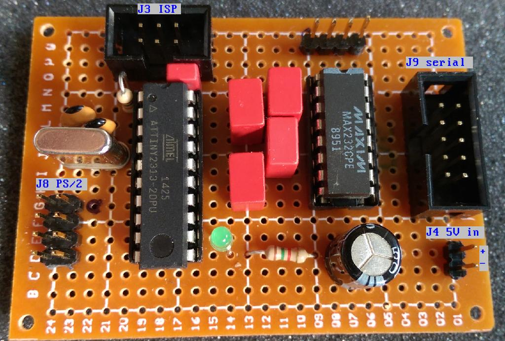
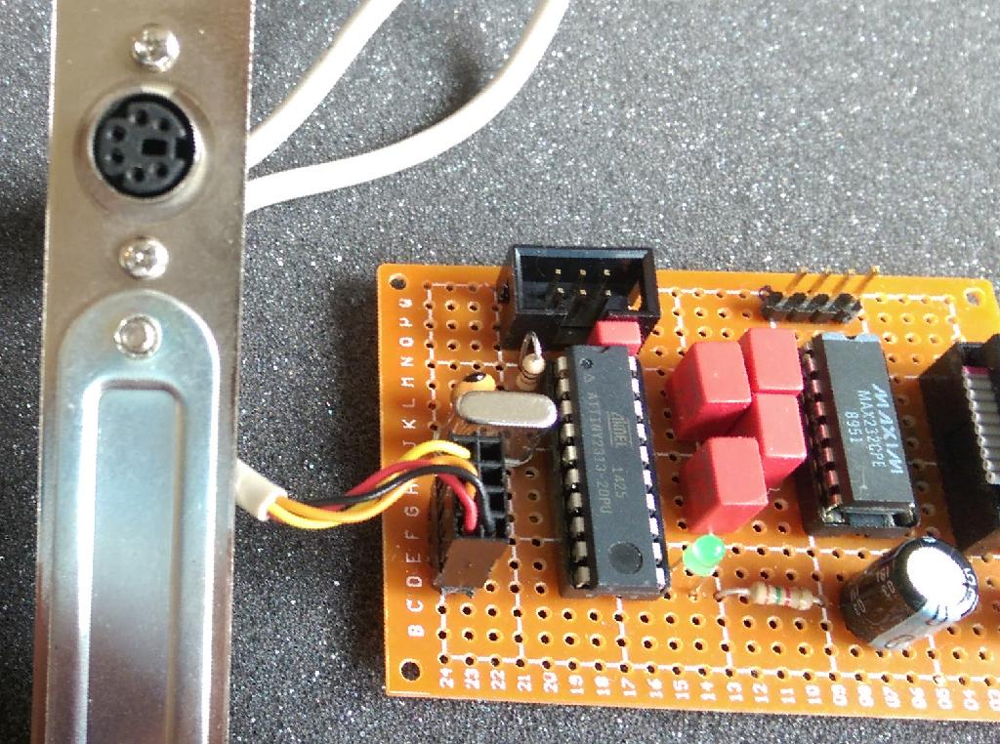
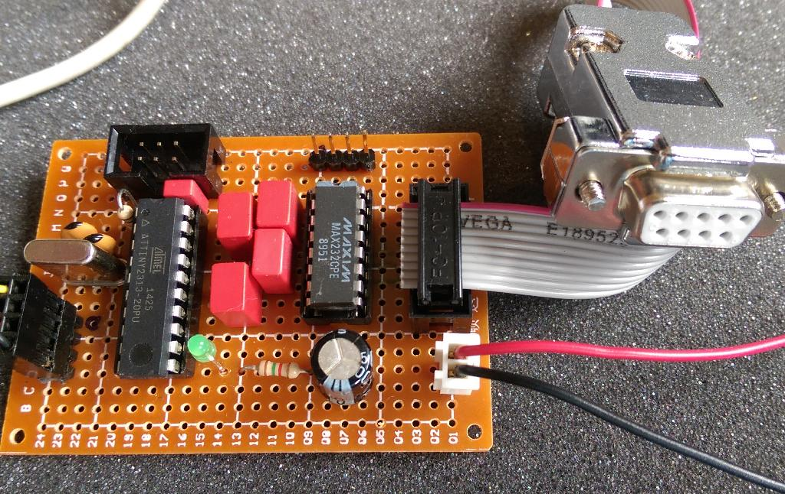

# PS/2 to serial mouse adapter

This is an intelligent adapter to connect PS/2 mouses to serial mouses uses in the 80s and 90s.
Hope to help some retro-computer enthusiasts connecting a "more modern" mouse to theold PC.

Currently tested with 2-button ball mouses. Untested with optical mouses, yet.

I made this for fun, use this software and built hardware at your own risk (and with great fun)!

# Hardware

The hardware basically consists of a ATtiny2313 microcontroller and a MAX232 level shifter. The PS/2 is connected to the INT0 and INT1 pins of the ATtiny2313. The internal pull-up resistors are used for the idle state. 

The serial mouse is connected via a MAX232 to the UART of the ATtiny2313.
The schematics will give more details.

This is the first prototype.

The PS/2 connection is matching the connector of the PS/2 connector bracket which I found in an assortment of old computer cables.

The RS232 connection for the mouse is a 1:1 connection between the Pin-header and the DB9 connector.
This allows to mount it inside an old PC and connect it directly to the interface card. 

Do not use the type of DB9 connectors which are crimped directly onto the cable! 

# Software

## How to build and program

First the assembler source code must be assembled into a hex file, then it can
be programmed to the microcontroller.

For assembling I use avr-gcc and avrdude under Ubuntu Linux

To install the assembler, simply execute

    sudo apt install gcc-avr avr-libc avrdude
    
To assemble the microncontroller software execute:

    cd sw/
    make
    
To program the device, avrdude is used with the AVR ISP mk2 programmer.
The fuses of the controller need to be programmed:

    avrdude -c avrispmkII -p t2313 -U lfuse:w:0xEE:m -U hfuse:w:0xDF:m -U efuse:w:0xFF:m

The assembled hex file is programmed like this:

    avrdude -c avrispmkII -p t2313 -e -U flash:w:mouse.hex -U flash:v:mouse.hex

or simply

    make program
